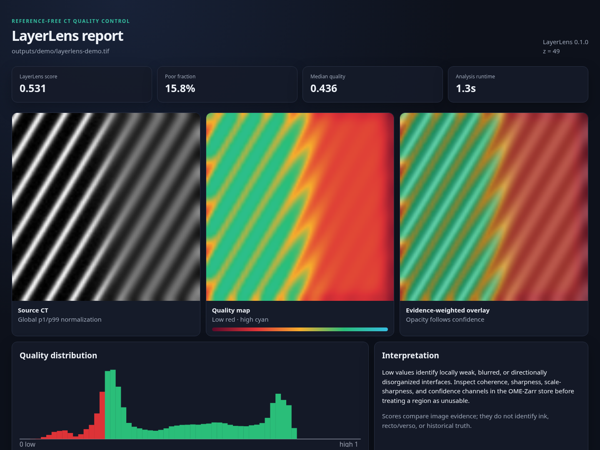

# LayerLens

[](https://github.com/streetquant/layerlens/actions/workflows/ci.yml)

LayerLens is a CPU-first, label-free diagnostic for local papyrus-layer
separability in Vesuvius Challenge CT data. It turns a TIFF or OME-Zarr volume
into a seam-safe, viewer-ready OME-Zarr quality map, compact JSON summary, and
optional self-contained visual report. A compact adapter places the result
directly over the source volume in Volume Cartographer (VC3D).

The project targets the [2026 open problem of uneven local scan
quality](https://scrollprize.org/2026_open_problems): compressed or hazy layers
can quietly undermine surface localization, tracing, and downstream ink work.
LayerLens makes those regions measurable before an expensive pipeline commits
to them.



_Deterministic synthetic walkthrough: sharp interfaces on the left transition
to locally blurred interfaces on the right. No challenge data is redistributed._

## What works now

- 2D and 3D TIFF, bare Zarr, and OME-Zarr input
- automatic OME-Zarr level discovery and physical-coordinate preservation
- lazy TIFF/Zarr reads and bounded-memory tiled execution with mathematically
  sufficient Gaussian halos
- five inspectable diagnostic channels: quality, coherence, sharpness,
  scale-normalized sharpness, and confidence
- OME-Zarr 0.5 / Zarr v3 output plus a stable JSON summary schema
- self-contained HTML QC report with source, heatmap, overlay, and provenance
- compact Zarr v2 `uint8` VC3D overlay and optional portable review project
- deterministic global normalization sampling for very large volumes
- optional anonymous or credentialed `s3://` access
- no model weights, labels, GPU, or scanner-specific fitting

The generated store has been accepted by the independent
[`ome-zarr-models`](https://ome-zarr-models-py.readthedocs.io/) reference
validator as an OME-Zarr 0.5 `Image`.

## Quick start

```bash
uv sync --extra dev

uv run layerlens scan.tif outputs/scan.layerlens.zarr \
  --tile-shape 160 \
  --stride 4

uv run layerlens-report scan.tif \
  outputs/scan.layerlens.zarr \
  outputs/scan.layerlens.html

uv run layerlens-vc3d \
  outputs/scan.layerlens.zarr \
  outputs/scan.layerlens-vc3d.ome.zarr
```

For 3D data, the report automatically shows the plane with the most
confidence-supported low-quality evidence. Select a plane explicitly with
`--axis z --index 512`. The HTML embeds its images and styles, so it can be
reviewed or shared as one offline file.

The VC3D export stores low quality as high overlay risk by default. To create a
project containing both the source and overlay, add
`--project outputs/scan-review.volpkg.json --base-volume /path/to/base.ome.zarr`.
See [the VC3D guide](docs/vc3d.md) for thresholds, coordinate-space tags, and
the compact physical-level storage contract.

For a calibrated TIFF, provide voxel sizes in array-axis order:

```bash
uv run layerlens scan.tif outputs/scan.layerlens.zarr \
  --voxel-size 7.91,7.91,7.91 \
  --unit micrometer
```

OME-Zarr calibration is discovered automatically. Non-OME groups can be
resolved explicitly with `--array-path`. Remote object storage is an optional
install:

```bash
uv sync --extra remote
uv run layerlens s3://bucket/path/scan.zarr outputs/scan.layerlens.zarr
```

Anonymous S3 is the default; use `--authenticated-s3` to use ambient
credentials. LayerLens never writes to the input store.

## Output

For `outputs/scan.layerlens.zarr`, LayerLens writes:

- `outputs/scan.layerlens.zarr/`: channel-first OME-Zarr v0.5 image
- `outputs/scan.layerlens.zarr.json`: scalar summary and full provenance
- `outputs/scan.layerlens.html`: optional visual report from `layerlens-report`
- `outputs/scan.layerlens-vc3d.ome.zarr/`: optional compact VC3D risk overlay

All channels are in `[0, 1]`. Higher `quality` means locally sharper and more
directionally organized papyrus interfaces. The scalar `score` is an
evidence-weighted summary for ranking regions from the same acquisition
context; it is not a universal pass/fail threshold.

See [the output contract](docs/output.md) and [the method](docs/method.md) for
the exact formulas and coordinate mapping.

## Validation snapshot

The frozen metric benchmark is **95.966 / 100**. Its components are:

- measured synthetic sheet-detection ordering: Spearman `0.904762`
- rotation and affine-intensity invariance: `0.999991`
- rejection of isotropic noise: `0.977608`
- monotonic blur/noise degradation on official 3D crops: `1.000000`
- Paris 4 high-resolution example preferred over the hazy example:
  `0.336923` versus `0.056203`

Twenty-four complete official surface-label cubes were processed as an
external localization check. Recto voxels had higher mean quality than other
valid voxels in **24/24 cubes**; mean recto-vs-other AUC was `0.6442`
(cube-bootstrap 95% CI `0.6154–0.6720`). This is deliberately reported as an
enrichment diagnostic, not as scan-quality ground truth: label `0` includes
legitimate non-recto papyrus structure.

On controlled degradation of the same 24 official cubes, the combined
blur/noise ordering was `0.9958`. Tenengrad and variance of Laplacian detected
blur but rewarded added noise, producing combined ranks of `0.0833` and
`0.0000`. LayerLens ordered all 24 noise sequences correctly.

On the current Threadripper 3960X CPU, lazy TIFF analysis took 9.0–9.2 seconds
for 256³ cubes and 15.7–21.9 seconds for 320³ cubes. A compressed 320³ output
is roughly 8 MB.

Full tables, negative controls, and limitations are in
[the validation report](docs/validation.md).

## Reproduce the evidence

```bash
uv run python -m benchmarks.prepare_official_crops
uv run python -m benchmarks.verify_metric
uv run pytest -q
uv run ruff check src tests benchmarks
```

Build the data-free walkthrough used above with:

```bash
uv run python -m benchmarks.make_demo
```

This one command writes the source TIFF, native analysis, self-contained HTML,
VC3D base volume, compact risk overlay, and portable
`outputs/demo/layerlens-demo.volpkg.json` review project. Open the HTML in a
browser or the project in VC3D; no challenge data is needed. The generated
base and physical overlay level were decoded successfully by the native C++
reader bundled in the official VC3D AppImage built from commit `1fe401a`.

To build a deterministic external validation sample from the official
surface-label corpus:

```bash
uv run python -m benchmarks.download_surface_samples \
  --count 24 --seed 20260718 --workers 2

uv run python -m benchmarks.validate_surface_corpus \
  --manifest data/cache/surface_validation_manifest.json \
  --workers 4

uv run python -m benchmarks.validate_degradations \
  --manifest data/cache/surface_validation_manifest.json \
  --workers 4

uv run python -m benchmarks.compare_baselines \
  --manifest data/cache/surface_validation_manifest.json \
  --workers 4
```

The downloader records source paths, sizes, and Xet object identifiers in a
local manifest before transferring data, marks it ready only after every TIFF
has been checked, resumes partial files, and uses multipart HTTP when `aria2c`
is available.

The exact 24-object manifest and machine-readable reports are committed under
[`docs/evidence`](docs/evidence/) so the published numbers do not depend on
this README's rounding.

## Design boundaries

LayerLens measures image evidence, not historical truth. It does not identify
ink, trace a surface, decide recto versus verso, or replace human review. Very
low-texture but valid papyrus can score low; strongly organized non-papyrus
edges can score high. Use the component channels and confidence map when
investigating an outlier.

The repository does not redistribute Vesuvius scans or labels. Obtain them
from the [official data catalog](https://scrollprize.org/data) and follow the
Vesuvius Challenge data terms.

Real scan-quality cases, negative results, and focused code changes are
welcome; see [the contribution guide](CONTRIBUTING.md) for a metadata-only
feedback template that does not require publishing restricted scans.

LayerLens code is MIT licensed.
